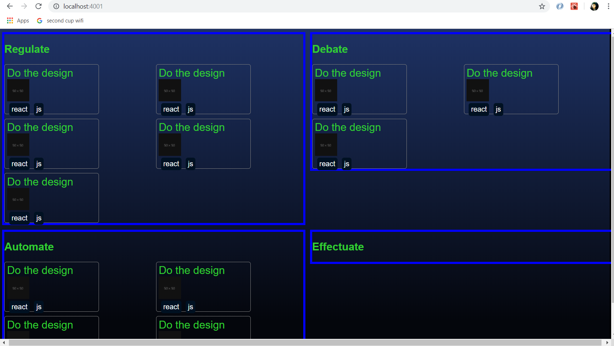

# Tasklify

Supercharged organizer + planner

> early stages in progress...

👷‍🚧

Preview:



## To dev:

```
$ npm checkout dev
$ npm install
$ npm run dev
```

- BACKEND server runs on 4001 - Node + express
- FRONTEND runs on 4000 - `webpack-dev-server` for React with hot-reloading

## To deploy:

```
$ npm run build
$ npm start
```

- builds `bundle.js` for production
- node server runs on 4000
